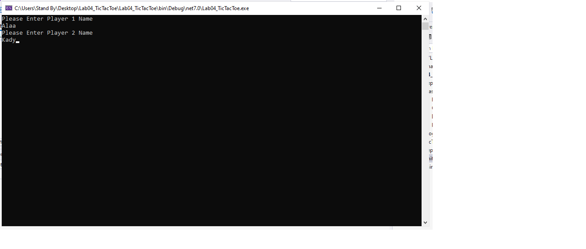
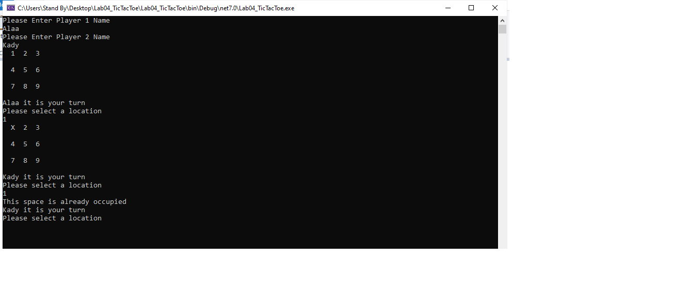
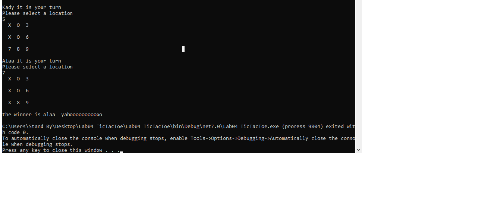
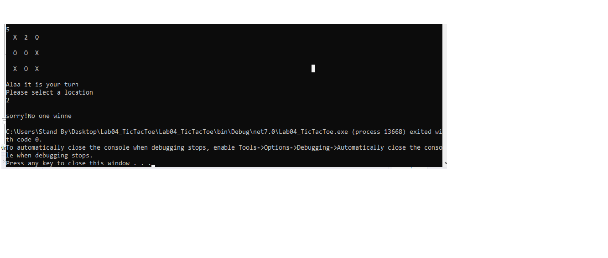

# TicTac
# Lab4-TicTac
This is a Tic Tac console Application written in C# language using Visual Studio
## How To play
1. at first you have to Enter the first player name and the sconed player name; first player will take (X) Marker and seconed player will take (O) Marker.

2. you will play one by one in turn by Entering the number of posistion you want from 1 to 9; if you Enter a number outside the list or Enter a number from the list Already taken the player will be asked to Enter a number again until choose a correct valid number.  

3. if one of the players won this message will apear.
4. 

5. if no one won this message will apear

